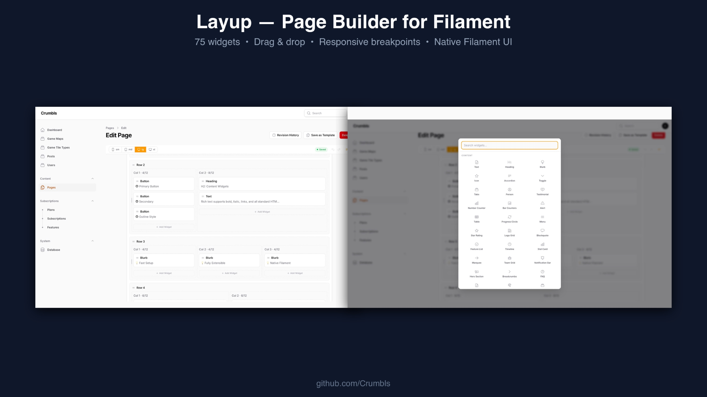

# Layup

A visual page builder plugin for [Filament](https://filamentphp.com). Divi-style editor with rows, columns, and 95 extensible widgets — all using native Filament form components.



## Features

- **Flex-based 12-column grid** with responsive breakpoints (sm/md/lg/xl)
- **Visual span picker** — click-to-set column widths per breakpoint
- **Drag & drop** — reorder widgets and rows
- **Undo/Redo** — Ctrl+Z / Ctrl+Shift+Z with full history stack
- **Widget picker modal** — searchable, categorized, grid layout
- **Three-tab form schema** — Content / Design / Advanced on every component
- **Full Design tab** — text color, alignment, font size, border, border radius, box shadow, opacity, background color, padding, margin
- **Responsive visibility** — show/hide per breakpoint on any element
- **Entrance animations** — fade in, slide up/down/left/right, zoom in (via Alpine x-intersect)
- **Frontend rendering** — configurable routes, layouts, and SEO meta (OG, Twitter Cards, canonical, JSON-LD)
- **Tailwind safelist** — automatic class collection for dynamic content
- **Page templates** — 5 built-in templates (blank, landing, about, contact, pricing) + save your own
- **Content revisions** — auto-save on content change, configurable max, restore from history
- **Export / Import** — pages as JSON files
- **Widget lifecycle hooks** — `onSave`, `onCreate`, `onDelete` with optional context
- **Content validation** — structural + widget type validation
- **Widget auto-discovery** — scans `App\Layup\Widgets` for custom widgets
- **Configurable model** — swap the Page model per dashboard
- **1,051 tests, 3,304 assertions**

### Built-in Widgets (75)

| Category | Widgets |
|----------|---------|
| **Content** | Text, Heading, Blurb, Icon, Accordion, Toggle, Tabs, Person, Testimonial, Number Counter, Bar Counter, Alert, Table, Progress Circle, Blockquote, Feature List, Timeline, Stat Card, Star Rating, Logo Grid, Menu, Testimonial Carousel, Comparison Table, Team Grid, Notification Bar, FAQ (with JSON-LD), Hero Section, Breadcrumbs |
| **Media** | Image (with hover effects), Gallery (with lightbox + captions), Video, Audio, Slider, Map, Before/After |
| **Interactive** | Button (hover colors), Call to Action, Countdown, Pricing Table, Social Follow, Search, Contact Form, Login, Newsletter Signup |
| **Layout** | Spacer, Divider, Marquee, Section (bg image/video/gradient/parallax) |
| **Advanced** | HTML, Code Block, Embed |

## Requirements

- PHP 8.2+
- Laravel 12+
- Filament 5
- Livewire 4

## Installation

### Prerequisites

Layup requires a working Filament installation. If you haven't set up Filament yet, install it first:

```bash
composer require filament/filament
php artisan filament:install --panels
```

This creates a panel provider at `app/Providers/Filament/AdminPanelProvider.php`. If you already have a Filament panel set up, skip this step.

See the [Filament installation docs](https://filamentphp.com/docs/panels/installation) for details.

### Install Layup

**1. Require the package:**

```bash
composer require crumbls/layup
```

**2. Run migrations:**

```bash
php artisan migrate
```

This creates the `layup_pages` and `layup_page_revisions` tables.

**3. Register the plugin in your Filament panel provider:**

Open your panel provider (e.g. `app/Providers/Filament/AdminPanelProvider.php`) and add the Layup plugin:

```php
use Crumbls\Layup\LayupPlugin;

public function panel(Panel $panel): Panel
{
    return $panel
        // ...
        ->plugins([
            LayupPlugin::make(),
        ]);
}
```

**4. Publish assets:**

```bash
php artisan vendor:publish --tag=layup-assets
```

**5. (Optional) Publish the config:**

```bash
php artisan vendor:publish --tag=layup-config
```

That's it. Head to your Filament panel — you'll see a **Pages** resource in the sidebar.

### Quick Verification

After installation, visit `/admin/pages` (or your panel path) and create a new page. You should see the visual builder with rows, columns, and the widget picker.

## Frontend Rendering

Layup includes an optional frontend controller that serves pages at a configurable URL prefix.

### Enable Frontend Routes

In `config/layup.php`:

```php
'frontend' => [
    'enabled' => true,
    'prefix'  => 'pages',       // → yoursite.com/pages/{slug}
    'middleware' => ['web'],
    'domain'  => null,           // Restrict to a specific domain
    'layout'  => 'layouts.app',  // Blade component layout
    'view'    => 'layup::frontend.page',
],
```

The `layout` value is passed to `<x-dynamic-component>`, so it should be a Blade component name. For example:

- `'layouts.app'` → `resources/views/components/layouts/app.blade.php`
- `'app-layout'` → `App\View\Components\AppLayout`

Your layout must accept a `title` slot and optionally a `meta` slot for SEO tags:

```blade
{{-- resources/views/components/layouts/app.blade.php --}}
<!DOCTYPE html>
<html>
<head>
    <title>{{ $title ?? '' }}</title>
    {{ $meta ?? '' }}
    @layupScripts
    @vite(['resources/css/app.css'])
</head>
<body>
    {{ $slot }}
</body>
</html>
```

### Nested Slugs

Pages support nested slugs via wildcard routing:

```
/pages/about          → slug: about
/pages/about/team     → slug: about/team
```

### Custom Controller

Layup provides a base controller for frontend rendering:

```
AbstractController      → Base (returns any Eloquent Model)
  └─ PageController     → Built-in slug-based lookup (ships with Layup)
```

Extend `AbstractController` to render any model that implements `getSectionTree()` and `getContentTree()`.

**Scaffold a controller:**

```bash
php artisan layup:make-controller PageController
```

Or create one manually:

```php
<?php

declare(strict_types=1);

namespace App\Http\Controllers;

use Crumbls\Layup\Http\Controllers\AbstractController;
use Crumbls\Layup\Models\Page;
use Illuminate\Database\Eloquent\Model;
use Illuminate\Http\Request;

class PageController extends AbstractController
{
    protected function getRecord(Request $request): Model
    {
        return Page::published()
            ->where('slug', $request->route('slug'))
            ->firstOrFail();
    }
}
```

Works with any model, not just Page:

```php
use App\Models\Post;

class PostController extends AbstractController
{
    protected function getRecord(Request $request): Model
    {
        return Post::where('slug', $request->route('slug'))
            ->firstOrFail();
    }
}
```

After creating your controller:

1. Register the route in `routes/web.php`:

    ```php
    use App\Http\Controllers\PageController;

    Route::get('/{slug}', PageController::class)->where('slug', '.*');
    ```

2. Disable the built-in routes in `config/layup.php`:

    ```php
    'frontend' => [
        'enabled' => false,
    ],
    ```

3. Set your layout component in `config/layup.php`:

    ```php
    'frontend' => [
        'layout' => 'layouts.app',
    ],
    ```

### Override Methods

`AbstractController` provides these methods your IDE will autocomplete. Override any of them to customize behavior:

| Method | Purpose | Default |
|--------|---------|---------|
| `getRecord(Request $request): Model` | **Required.** Resolve the model. | (abstract) |
| `authorize(Request $request, Model $record): void` | Gate access. Throw/abort to deny. | No-op |
| `getLayout(Request $request, Model $record): string` | Blade layout component name. | `config('layup.frontend.layout')` |
| `getView(Request $request, Model $record): string` | Blade view to render. | `config('layup.frontend.view')` |
| `getViewData(Request $request, Model $record, array $sections): array` | Extra variables merged into view data. | `[]` |
| `getCacheTtl(Request $request, Model $record): ?int` | Seconds for `Cache-Control` header. `null` to skip. | `null` |

Your `getRecord()` returns `Model`, so you can return `Page`, a custom subclass, or any model with the right methods.

### View Variables

The following variables are available in the rendered Blade view:

| Variable | Type | Description |
|----------|------|-------------|
| `$page` | `Model` | The resolved record (also available as `$record`) |
| `$record` | `Model` | Same as `$page` (alias for non-Page models) |
| `$sections` | `array` | Section tree with hydrated Row/Column/Widget objects |
| `$tree` | `array` | Flat list of Row objects (all sections merged) |
| `$layout` | `string` | Layout component name |

Plus any additional variables returned by `getViewData()`.

### Example: Authorized Pages with Custom Layout

```php
class MemberPageController extends AbstractController
{
    protected function getRecord(Request $request): Model
    {
        return Page::published()
            ->where('slug', $request->route('slug'))
            ->firstOrFail();
    }

    protected function authorize(Request $request, Model $record): void
    {
        abort_unless($request->user(), 403);
    }

    protected function getLayout(Request $request, Model $record): string
    {
        return 'layouts.member-area';
    }

    protected function getViewData(Request $request, Model $record, array $sections): array
    {
        return [
            'user' => $request->user(),
        ];
    }
}
```

### Example: Cached Public Pages

```php
class CachedPageController extends AbstractController
{
    protected function getRecord(Request $request): Model
    {
        return Page::published()
            ->where('slug', $request->route('slug'))
            ->firstOrFail();
    }

    protected function getCacheTtl(Request $request, Model $record): ?int
    {
        return 300; // 5 minutes
    }
}
```

### Example: View Fallback Chain

```php
class ThemePageController extends AbstractController
{
    protected function getRecord(Request $request): Model
    {
        return Page::published()
            ->where('slug', $request->route('slug'))
            ->firstOrFail();
    }

    protected function getView(Request $request, Model $record): string
    {
        $slugView = 'pages.' . str_replace('/', '.', $record->slug);

        if (view()->exists($slugView)) {
            return $slugView;
        }

        return parent::getView($request, $record);
    }
}
```

## Tailwind CSS Integration

Layup generates Tailwind utility classes dynamically — column widths like `w-6/12`, `md:w-3/12`, gap values, and any custom classes users add via the Advanced tab. Since Tailwind scans source files (not databases), these classes need to be safelisted.

### How It Works

Layup provides two layers of class collection:

1. **Static classes** — Every possible Tailwind utility the plugin can generate (column widths × 4 breakpoints, flex utilities, gap values). These are finite and ship with the package.
2. **Dynamic classes** — Custom classes users type into the "CSS Classes" field on any row, column, or widget's Advanced tab.

Both are merged into a single safelist file.

### Quick Setup

**1. Generate the safelist file:**

```bash
php artisan layup:safelist
```

This writes `storage/layup-safelist.txt` with all classes (static + from published pages).

**2. Add to your CSS (Tailwind v4):**

```css
/* resources/css/app.css */
@import "tailwindcss";
@source "../../storage/layup-safelist.txt";
```

**3. Build:**

```bash
npm run build
```

That's it. All Layup classes will be included in your compiled CSS.

### Tailwind v3

If you're on Tailwind v3, add the safelist file to your `tailwind.config.js`:

```js
module.exports = {
    content: [
        './resources/**/*.blade.php',
        './storage/layup-safelist.txt',
    ],
    // ...
}
```

### Build Pipeline Integration

Add the safelist command to your build script so it always runs before Tailwind compiles:

```json
{
    "scripts": {
        "build": "php artisan layup:safelist && vite build"
    }
}
```

Or in a deploy script:

```bash
php artisan layup:safelist
npm run build
```

### Auto-Sync on Save

By default, Layup regenerates the safelist file every time a page is saved. If new classes are detected, it dispatches a `SafelistChanged` event.

```php
'safelist' => [
    'enabled'   => true,   // Enable safelist generation
    'auto_sync' => true,   // Regenerate on page save
    'path'      => 'storage/layup-safelist.txt',
],
```

#### Listening for Changes

Use the `SafelistChanged` event to trigger a rebuild, send a notification, or log the change:

```php
use Crumbls\Layup\Events\SafelistChanged;

class HandleSafelistChange
{
    public function handle(SafelistChanged $event): void
    {
        // $event->added   — array of new classes
        // $event->removed — array of removed classes
        // $event->path    — path to the safelist file

        logger()->info('Layup safelist changed', [
            'added'   => $event->added,
            'removed' => $event->removed,
        ]);

        // Trigger a rebuild, notify the team, etc.
    }
}
```

Register in your `EventServiceProvider`:

```php
protected $listen = [
    \Crumbls\Layup\Events\SafelistChanged::class => [
        \App\Listeners\HandleSafelistChange::class,
    ],
];
```

#### How Change Detection Works

Layup uses Laravel's cache (any driver — file, Redis, database, array) to store a hash of the last known class list. On page save, it regenerates the list, compares the hash, and only dispatches the event if something actually changed.

The safelist file write is **best-effort** — if the filesystem is read-only (serverless, containerized deploys), the write silently fails but the event still fires. You can listen for the event and handle the rebuild however your infrastructure requires.

#### Disabling Auto-Sync

If you don't want safelist regeneration on every save (e.g., in production where you build once at deploy time):

```php
'safelist' => [
    'auto_sync' => false,
],
```

You'll need to run `php artisan layup:safelist` manually or as part of your deploy pipeline.

### Command Options

```bash
# Default: write to storage/layup-safelist.txt
php artisan layup:safelist

# Custom output path
php artisan layup:safelist --output=resources/css/layup-classes.txt

# Print to stdout (pipe to another tool)
php artisan layup:safelist --stdout

# Static classes only (no database query — useful in CI)
php artisan layup:safelist --static-only
```

### What Gets Safelisted

| Source | Classes | Example |
|--------|---------|---------|
| Column widths | `w-{n}/12` × 4 breakpoints | `w-6/12`, `md:w-4/12`, `lg:w-8/12` |
| Flex utilities | `flex`, `flex-wrap` | Always included |
| Gap values | `gap-{0-12}` | `gap-4`, `gap-8` |
| User classes | Anything in the "CSS Classes" field | `my-hero`, `bg-blue-500` |

Widget-specific classes (like `layup-widget-text`, `layup-accordion-item`) are **not** Tailwind utilities — they're styled by Layup's own CSS and don't need safelisting.

## Frontend Scripts

Layup's interactive widgets (accordion, tabs, toggle, countdown, slider, counters) use Alpine.js components. By default, the required JavaScript is inlined automatically via the `@layupScripts` directive.

### Auto-Include (default)

No setup needed. The scripts are injected inline on any page that uses `@layupScripts` (included in the default page view).

```php
// config/layup.php
'frontend' => [
    'include_scripts' => true,  // default
],
```

### Bundle Yourself

If you'd rather include the scripts in your own Vite build (for caching, minification, etc.), disable auto-include and import the file:

```php
// config/layup.php
'frontend' => [
    'include_scripts' => false,
],
```

```js
// resources/js/app.js
import '../../vendor/crumbls/layup/resources/js/layup.js'
```

### Publish and Customize

```bash
php artisan vendor:publish --tag=layup-scripts
```

This copies `layup.js` to `resources/js/vendor/layup.js` where you can modify it.

### Available Alpine Components

| Component | Widget | Parameters |
|-----------|--------|------------|
| `layupAccordion` | Accordion | `(openFirst = true)` |
| `layupToggle` | Toggle | `(open = false)` |
| `layupTabs` | Tabs | none |
| `layupCountdown` | Countdown | `(targetDate)` |
| `layupSlider` | Slider | `(total, autoplay, speed)` |
| `layupCounter` | Number Counter | `(target, animate)` |
| `layupBarCounter` | Bar Counter | `(percent, animate)` |

## Custom Widgets

Create a widget by extending `Crumbls\Layup\View\BaseWidget`:

```php
use Crumbls\Layup\View\BaseWidget;
use Filament\Forms\Components\TextInput;
use Filament\Forms\Components\RichEditor;

class MyWidget extends BaseWidget
{
    public static function getType(): string { return 'my-widget'; }
    public static function getLabel(): string { return 'My Widget'; }
    public static function getIcon(): string { return 'heroicon-o-cube'; }
    public static function getCategory(): string { return 'custom'; }

    public static function getContentFormSchema(): array
    {
        return [
            TextInput::make('data.title')->label('Title')->required(),
            RichEditor::make('data.content')->label('Content'),
        ];
    }

    public static function getDefaultData(): array
    {
        return [
            'title' => '',
            'content' => '',
        ];
    }

    public static function getPreview(array $data): string
    {
        return $data['title'] ?: '(empty)';
    }

    public function render(): \Illuminate\Contracts\View\View
    {
        return view('widgets.my-widget', ['data' => $this->data]);
    }
}
```

The form schema automatically inherits Design (spacing, background) and Advanced (id, class, inline CSS) tabs from `BaseWidget`. You only define the Content tab.

### Register via config

```php
// config/layup.php
'widgets' => [
    // ... built-in widgets ...
    \App\Layup\MyWidget::class,
],
```

### Register via plugin

```php
LayupPlugin::make()
    ->widgets([MyWidget::class])
```

### Remove built-in widgets

```php
LayupPlugin::make()
    ->withoutWidgets([
        \Crumbls\Layup\View\HtmlWidget::class,
        \Crumbls\Layup\View\SpacerWidget::class,
    ])
```

## Artisan Commands

| Command | Description |
|---------|-------------|
| `layup:make-controller {name}` | Scaffold a frontend controller extending AbstractController |
| `layup:make-widget {name}` | Scaffold a custom widget (PHP class + Blade view) |
| `layup:safelist` | Generate the Tailwind safelist file |
| `layup:audit` | Audit page content for structural issues |
| `layup:export` | Export pages as JSON files |
| `layup:import` | Import pages from JSON files |
| `layup:install` | Run the initial setup |

## Configuration Reference

```php
// config/layup.php
return [
    // Widget classes available in the page builder
    'widgets' => [ /* ... */ ],

    // Page model and table name (swap per dashboard)
    'pages' => [
        'table' => 'layup_pages',
        'model' => \Crumbls\Layup\Models\Page::class,
    ],

    // Frontend rendering
    'frontend' => [
        'enabled'    => true,
        'prefix'     => 'pages',
        'middleware'  => ['web'],
        'domain'     => null,
        'layout'     => 'layouts.app',
        'view'       => 'layup::frontend.page',
    ],

    // Tailwind safelist
    'safelist' => [
        'enabled'   => true,
        'auto_sync' => true,
        'path'      => 'storage/layup-safelist.txt',
    ],

    // Frontend container class (applied to each row's inner wrapper)
    // Use 'container' for Tailwind's default, or 'max-w-7xl', etc.
    'max_width' => 'container',

    // Responsive breakpoints
    'breakpoints' => [
        'sm' => ['label' => 'sm', 'width' => 640,  'icon' => 'heroicon-o-device-phone-mobile'],
        'md' => ['label' => 'md', 'width' => 768,  'icon' => 'heroicon-o-device-tablet'],
        'lg' => ['label' => 'lg', 'width' => 1024, 'icon' => 'heroicon-o-computer-desktop'],
        'xl' => ['label' => 'xl', 'width' => 1280, 'icon' => 'heroicon-o-tv'],
    ],

    'default_breakpoint' => 'lg',

    // Row layout presets (column spans, must sum to 12)
    'row_templates' => [
        [12], [6, 6], [4, 4, 4], [3, 3, 3, 3],
        [8, 4], [4, 8], [3, 6, 3], [2, 8, 2],
    ],
];
```

## Multiple Dashboards

To use Layup across multiple Filament panels with separate page tables:

```php
// Panel A
LayupPlugin::make()
    ->model(PageA::class)    // or set via config

// Panel B — different table
LayupPlugin::make()
    ->model(PageB::class)
```

Your custom model with your overrides:

```php
class PageB extends \Crumbls\Layup\Models\Page
{
}
```

## Contributing

See [CONTRIBUTING.md](CONTRIBUTING.md) for development setup, code style, and testing guidelines.

## Vision & Roadmap

See [VISION.md](VISION.md) for where Layup is headed and how you can help shape it.

## License

MIT — see [LICENSE.md](LICENSE.md)
